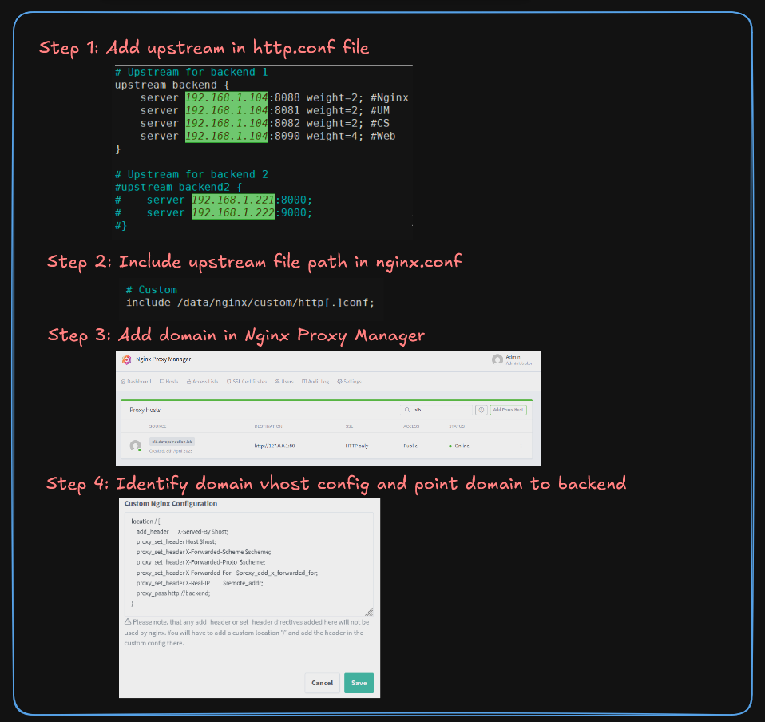

# Nginx Proxy Manager Load-Balancer Setup Guide

<p align="center">
  <picture>
    <source media="(prefers-color-scheme: dark)" srcset="https://github.com/meibraransari/nginx-proxy-manager/blob/main/assets/npm.png">
    <source media="(prefers-color-scheme: light)" srcset="https://github.com/meibraransari/nginx-proxy-manager/blob/main/assets/npm.png">
    
  </picture>
    <br>
    <strong>Nginx Proxy Manager</strong>
</p>


## 🎬 Nginx Proxy Manager Complete Playlist
[](https://www.youtube.com/playlist?list=PL5Afhqcc17s2UCcuEyFnTMHbVkxl8EG_7)

### Configuration Guide

###### We leverage of custom-nginx-configurations (Included at the end of the main http block)
https://nginxproxymanager.com/advanced-config/#custom-nginx-configurations

#### Configuration will be in 4 Part.


### Step 1. Add upstream in http.conf file
###### Inspect Nginx Proxy Manager Mount Path

```
CONATINER=npm
docker inspect $CONATINER | grep -i -A 17 "Mounts"
```
###### Create Custom Directory
On above we got mounted path as "/root/npm/nginx-proxy-manager/data/" so create directory on that path.
```
mkdir -p /root/npm/nginx-proxy-manager/data/nginx/custom
ls /root/npm/nginx-proxy-manager/data/nginx/custom

```
###### Create upstream backend
```
nano /root/npm/nginx-proxy-manager/data/nginx/custom/http.conf
```
```
# Upstream for backend 1
upstream backend {
    server 192.168.1.104:8088 weight=2; #Nginx
    server 192.168.1.104:8081 weight=2; #UM
    server 192.168.1.104:8082 weight=2; #CS
    server 192.168.1.104:8090 weight=4; #Web
}

# Upstream for backend 2
#upstream backend2 {
#    server 192.168.192.222:8000;
#    server 192.168.192.222:9000;
#}

# You can add multiple backend with custom name here as shown above....
```

###### Verify upstream backend
```
docker exec $CONATINER cat /data/nginx/custom/http.conf
```
##### Load Balancing Algorithm
For more information, see the [LB-Algorithm](../assets/load-balancing-algorithm.gif) file.
##### Upstream Examples:
For more information, see the [Upstream](../assets/upstream.md) file.

### Steps 2. Include upstream file path in nginx.conf
##### Check and add http.conf file path in nginx.conf if not present
```
docker exec $CONATINER cat /etc/nginx/nginx.conf
```
##### If not present then add 
```
docker exec -it $CONATINER /bin/bash
apt update
apt install nano -y
nano /etc/nginx/nginx.conf
```
Note:- There is no mount of "nginx.conf" to host that's why we are editing in container.
##### Include custom backend config file in "**http**" block in the last
```
include /data/nginx/custom/http[.]conf
```

##### Exit from the container
```
exit
```


### Steps 3. Add domain in NPM

##### Add domain in Nginx proxy manager
In my case I am adding demo domain like "alb.devopsinaction.lab" in nginx proxy manager

NPM > Host > Proxy Host > Add Proxy Host

Domain: alb.devopsinaction.lab

Forward Hostname / IP*: 127.0.0.1 #no-use-of-it-in-lb-case

Forward Port *:  80 #no-use-of-it-in-lb-case

### Steps 4. Identify domain vhost config and point domain to backend

##### Find domain file name 
```
docker inspect $CONATINER | grep -i -A 17 "Mounts"
grep -ir "alb.devopsinaction.lab" /root/npm/nginx-proxy-manager/data/nginx/
```

##### Change in domain and verify block
NPM > Host > Proxy Host > Edit Proxy Host > Advance > Custom Nginx Configuration

Add #check-block
###### Verify block
```
cat /root/npm/nginx-proxy-manager/data/nginx/proxy_host/22.conf
```

##### Copy Proxy of Nginx Proxy Manager 
```
docker exec $CONATINER cat /etc/nginx/conf.d/include/proxy.conf
```

Output:
```
add_header       X-Served-By $host;
proxy_set_header Host $host;
proxy_set_header X-Forwarded-Scheme $scheme;
proxy_set_header X-Forwarded-Proto  $scheme;
proxy_set_header X-Forwarded-For    $proxy_add_x_forwarded_for;
proxy_set_header X-Real-IP          $remote_addr;
proxy_pass       $forward_scheme://$server:$port$request_uri;
```

##### Set config using above proxy host config
NPM > Host > Proxy Host > Edit Proxy Host > Advance > Custom Nginx Configuration

```
location / {
    add_header       X-Served-By $host;
    proxy_set_header Host $host;
    proxy_set_header X-Forwarded-Scheme $scheme;
    proxy_set_header X-Forwarded-Proto  $scheme;
    proxy_set_header X-Forwarded-For    $proxy_add_x_forwarded_for;
    proxy_set_header X-Real-IP          $remote_addr;
    proxy_pass http://backend;
}
```

🔔 **Note**:
> Replace above config to your backend as shown above.
> "proxy_pass $forward_scheme://$server:$port$request_uri;" 
> to 
> "proxy_pass http://backend;"

ℹ️ **Info**:
> This will essentially remove the configuration of your endpoint as a reverse proxy (removes the proxy configuration line) and adds only your custom config. 

**In this case NPM workflow will be like:**

Proxy host --> Domain(alb.devopsinaction.lab) --> Skipped(Forward Hostname / IP+ Forward Port ) --> Custom config --> Backend(upstream)

##### Add SSL (If required)
NPM > Host > Proxy Host > Edit Proxy Host > SSL > Select SSL > Save.


### 💼 Connect with me 👇👇 😊

- 🔥 [**Youtube**](https://www.youtube.com/@DevOpsinAction?sub_confirmation=1)
- ✍ [**Blog**](https://ibraransari.blogspot.com/)
- 💼 [**LinkedIn**](https://www.linkedin.com/in/ansariibrar/)
- 👨‍💻 [**Github**](https://github.com/meibraransari?tab=repositories)
- 💬 [**Telegram**](https://t.me/DevOpsinActionTelegram)
- 🐳 [**Docker**](https://hub.docker.com/u/ibraransaridocker)
